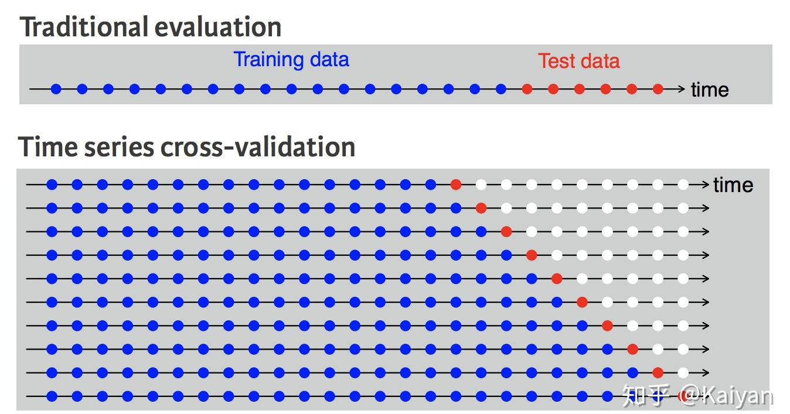
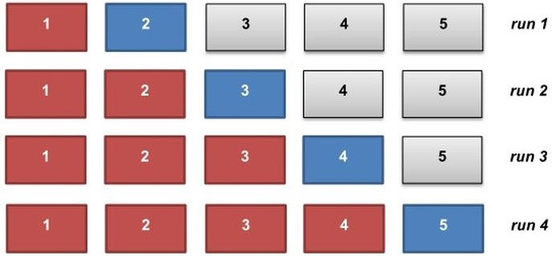

# Time-Series-Walk-Forward-Modeling

时间序列Walk-forward建模

### 1. 问题背景

数据驱动的**有监督时间序列建模**过程中一类重要的问题便是**如何划分数据集用于模型的训练和测试**。由于序列数据中存在时间先后, 对于存在时间特性的分类或者回归问题不能简单的使用StratifiekdKFold或者KFold进行交叉验证，更不能shuffle，否则会带来一些问题:

  1. 非平稳时间序列: 若不对样本进行shuffle, 使用较早时期的样本训练所得模型可能不适用于一段时间以后的新样本
  2. 时序特征交叉: 若对样本进行shuffle, 则最终的模型测试指标可能失真, 因为测试集中的某条样本往往与训练集中的某样本高度相似

### 2. 时间序列交叉验证

关于时间序列的交叉验证主要采用滑动窗口交叉验证方式, 其与传统的机器学习交叉验证方式对比如下[^1]:

或者更一般地, 如下图所示将数据沿着时间方向分为若干折. 在每一轮训练和测试中, 只有红色所示的部分用于模型训练, 这样没有未来信息进入模型, 确保模型仅获得来自**历史数据**中的模式.

时间序列交叉验证代码实现可参考Python中的TSCV包[^2], 此处不再详细讨论.

**思考**
* 对于有的不依赖迭代学习的模型, 如随机森林, 在每轮训练过程中模型都必须完成充分训练
  * 代码: src/air_passengers/rf_walk_forward.py 
* 对于依赖迭代的模型, 如GBDT等, 每轮训练过程中模型都可以不用进行充分训练, 类似fine-tune. 
  * 代码: src/air_passengers/mlp_walk_forward.py 

### 3. 深度学习中的改进和应用

在第2节中的CV方式可以看出, 在每一轮计算中, 都需要在训练集上训练好模型后再在对应测试集上进行测试. 但这样就存在问题: 

  1. 每轮训练测试都会单独获得一个模型, 最后的模型应该选择哪个? 
  2. 单独选择某轮的模型都会造成算力和样本的浪费
  3. 如果对每一轮都训练一个神经网络, 那么计算代价应该是很大的

考虑到神经网络在训练时具有迭代寻优的特点, 那么我们可以将整个CV过程改写为在每一轮按照较小的学习率进行fine-tune, 最后获得的模型将会尽可能满足对于每轮的学习效果综合最优. 即:

$$
\begin{aligned}
min \quad &\sum_i RMSE_i \\
s.t. \quad &RMSE_i = RMSE(y_i,f(x_i)), \text{for }i = 1,2,...k \\
\end{aligned}
$$

需按照上式对模型训练目标函数进行改写.

[^1]: 知乎回答: https://www.zhihu.com/question/39639128  
[^2]: TSCV算法包: http://www.zhengwenjie.net/tscv/
